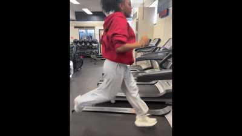
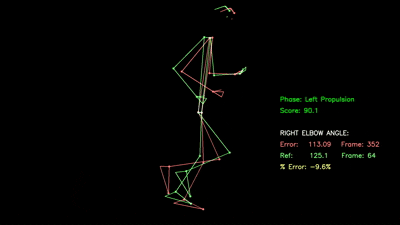

# Human Motion Analysis: Tracking Athletic Performance, Injury Prevention, and Movement Disabilities

## Overview:
This project aims to create an inexpensive and accessible system for analyzing human movement from video. Using pose estimation and machine learning, the system extracts biomechanical features from activities such as walking and running to evaluate performance, detect movement patterns, and identify potential injury risks.

The long-term goal is to support applications in athletic performance analysis, injury prevention, and movement disorder assessment.

## Pipeline:
| Step | Tool                            | Use                                                                                                                                                                       |
|------|---------------------------------|---------------------------------------------------------------------------------------------------------------------------------------------------------------------------|
| 1    | Pose Estimation                 | Extract pose landmarks, joint angles, velocities using Google's MediaPipe library with custom normalization to enable standard comparison across datasets                 |
| 2    | 1D Convolutional Neural Network | Predict gait phases using a 1D Convolutional Neural Network that analyzes temporal patterns in pose landmark sequences.                                                   |
| 3    | Median Absolute Deviation (MAD) | Compute deviation from reference motion patterns using Median Absolute Deviation (MAD) and calculate each feature's similarity scores over time using MAD-based Z-scores. |
| 4    | OpenCV + Matplotlib             | Generate visualizations using OpenCV and Matplotlib including pose skeleton overlays comparing user movement to reference motion and plots of feature Z-scores over time. |

## Example:
| Input                                  | Output                                |
|----------------------------------------|---------------------------------------|
|  |  |

### Output:
[future explanation of what the output is]